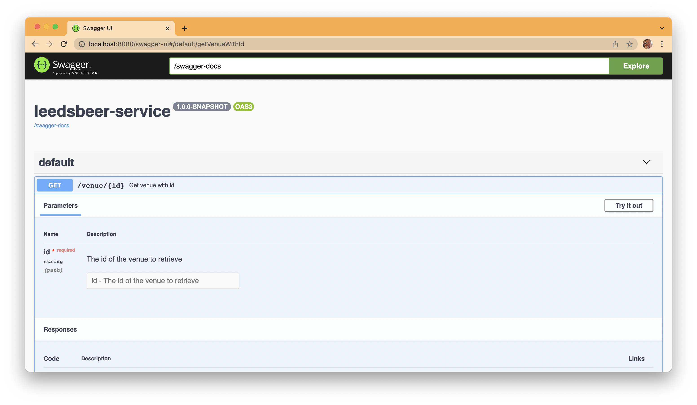

# Leeds Beer Quest

For the the first part of the challenge I've focused on the infrastructure parts required to build, host and run the various parts of the application. 

Initially I've got:

* A barebones application server implemented in Java using Javalin which is a lightweight web framework providing little more than a thin veneer over Jetty
* Standard SQL scripts to create a BEER schema and VENUE table
* A python script to convert the initial CSV dataset into a series of SQL inserts
* Those SQL scripts in a folder which can then be run by a Java tool called flyway which maintains a record of migrations run and will automatically upgrade the database as required
* Two simple integration tests that:
  - an implementation of a http endpoint to retrieve the details for a venue given it's id. It will behave sensibly if the id doesn't exist or an internal server error occurs
  - validates the flyway migration scripts have been run, the schema is present and the initial dataset has been loaded
* Docker build file for the application server and a docker compose file to run the application server and a mariadb instance

What I've not done:

* Anything on the UI side
* I would probably have something like nginx serving a React web application

## Database and testing

Whilst the deployed application uses MariaDB the integration tests use an inmemory h2 instance.

Ideally I would have used MariaDB4J which is an embeddable version of MariaDB. However it doesn't work on my machine as there are [issues with Apple M1 silicon](https://stackoverflow.com/questions/69896059/is-it-possible-to-get-mariadb4j-to-work-on-an-m1-mac)

h2 is a lightweight Java embeddable database and does offer some MySQL/Maria compatibility and as long as the SQL is compliant the scripts should work on both types. 

There was some fun trying to get it working as flyway would run and then when connecting with JDBC in the integration test it couldn't find the schema. This turned out to be around how the different databases [handle table names and casing](https://stackoverflow.com/questions/14972408/schema-related-problems-with-flyway-spring-and-h2-embedded-database).

The python script to convert the dataset from CSV to SQL inserts is found under the `scripts` directory. It was run like so:

```
$ python3 convert_csv_to_sql_inserts.py -i ../service/docs/original_dataset/leedsbeerquest.csv --output ../service/src/main/resources/db/migration/V2__insert_venue_data.sql
Running with input=[../service/docs/original_dataset/leedsbeerquest.csv] and output=[../service/src/main/resources/db/migration/V2__insert_venue_data.sql]
```

As h2 runs in memory the database is thrown away after each run of the integration test class ensuring that the migration scripts are run and validated each time.

## Running Locally

To run the application it has the following pre-requisites:

* Java 17 installed
* Maven installed (tested on `3.8.4`)
* Docker and docker compose installed

**Note:** python3 would be required if you wished to run the dataset conversion but this isn't necessary as it's already been done.

First build the application from source:

1. `cd service`
1. `mvn clean install`

Once that has built then run docker compose:

1. `cd ../docker-compose`
1. `docker-compose up`

This will start both the database and application containers and once the database is up the application will connect and run the flyway migration scripts (if required) and then Javalin on port `8080`.

To validate it's working then try calling querying for one of the venues in another terminal:

```
$ curl localhost:8080/venue/101 | jq .
{
  "id": 101,
  "name": "Oporto",
  "category": "Bar reviews",
  "url": "http://leedsbeer.info/?p=993",
  "timestamp": "2013-02-05T20:11:03Z",
  "excerpt": "A music (and hot dog) venue on the Call Lane strip. Nice amenities, but just so-so beer. ",
  "thumbnail": "http://leedsbeer.info/wp-content/uploads/2013/02/20130204_184152.jpg",
  "latitude": 53.7956581,
  "longitude": -1.5408245,
  "address": "33 Call Lane, Leeds LS1 7BT",
  "phone": "0113 245 4444",
  "twitterHandle": "Oportobar",
  "ratings": {
    "beer": 2,
    "atmosphere": 2,
    "amenities": 3,
    "value": 1.5
  },
  "tags": [
    "food",
    "free wifi",
    "live music",
    "sofas"
  ]
}
```

In the example above the output has been piped to `jq` to format it nicely.

With the initial data set the ids range from 1 -> 242. An example when an invalid id is used:

```
$ curl localhost:8080/venue/260 -v    
*   Trying ::1:8080...
* Connected to localhost (::1) port 8080 (#0)
> GET /venue/260 HTTP/1.1
> Host: localhost:8080
> User-Agent: curl/7.77.0
> Accept: */*
> 
* Mark bundle as not supporting multiuse
< HTTP/1.1 404 Not Found
< Date: Fri, 04 Mar 2022 12:52:51 GMT
< Content-Type: text/plain
< Content-Length: 0
< 
* Connection #0 to host localhost left intact
```

## Things to note in the application

I've done a bit more work on the application after being asked to flesh it out a bit more. 

Things of note:

* As it's been TDD'd coverage is fairly high and added the JaCoCo plugin to ensure the build fails if the measure of complexity covered drops below 90% (see pom file)
* Have used a hexagonal (ports and adapters) type architecture which is fairly simple in this example
* The http endpoint only needs to interact with the repository and nothing else
* The repository is an interface so we could replace the database with an inmemory representation based off the csv file or whatever
* The http endpoint contains no business logic, it's only concern is mapping to domain objects and back and reporting the correct http codes
* The repository implementation is tested against an inmemory database as that's the best way to ensure the SQL is valid, etc
* Using an ORM such as hibernate felt like overkill for this application and so it's simple JDBC
* Having different representations for the dtos and domain might feel like overkill but allows different APIs to be created easily, e.g. could expose it over a messaging layer, etc
* The unit test for the endpoint uses a mock repository to decouple it from requiring a database
* The integration test for retrieving venues by id simply tests the happy path as the variations and detail about mapping fields are covered in the relevant unit tests 
* Have used the builder pattern in the domain for the [`Venue`](service/src/main/java/com/leedsbeer/service/domain/Venue.java) and [`Ratings`](service/src/main/java/com/leedsbeer/service/domain/Ratings.java) objects. This enforces the user must supply the mandatory fields and is a fluent api reducing the risk of setting parameters in the wrong order which would be easily done by transposing fields when invoking a constructor. It also has the advantage it doesn't breach static code analysis rules about having to many parameters to a constructor as only the builder is passed.
* Allows use of the [test data pattern](service/src/test/java/com/leedsbeer/service/test/TestData.java) for easy creation of test data. 
* Have added swagger documentation for the endpoint (see section below)

## Swagger Documentation

Javalin comes with an OpenApi module which makes it fairly trivial to add swagger documentation that will stay in sync with the code and enable integration with the api.

To view the documentation when it is running browse to [http://localhost:8080/swagger-ui](http://localhost:8080/swagger-ui). To view the underlying open api spec it can be found at [http://localhost:8080/swagger-docs](http://localhost:8080/swagger-docs).


